<div align="center">

# AI-Based Reliable Droplet Routing for MEDA Biochips

**Moving droplets across a lab-on-a-chip whose electrodes wear out with use,
using health-aware path planning and deep reinforcement learning.**

[](requirements.txt)
[](medaroute/env.py)
[](experiments/exp4_ppo.py)
[](tests/)
[](LICENSE)

B.Tech Project · Department of Computer Science and Engineering ·
Netaji Subhas University of Technology (NSUT) · Supervisor: Dr. Ankur Gupta

</div>

---

## Key results at a glance

> [!IMPORTANT]
> **Reading electrode health pays off, and it matters more the more worn the chip is.**
>
> | | Plain A\* | Health-aware A\* | Gain |
> |---|:---:|:---:|:---:|
> | Success on a heavily worn chip (70% degradable electrodes) | 22.8% | **49.2%** | **2.2× more tasks completed** |
> | Tasks before the first failure on a fresh chip | 241 | **397** | **~65% longer chip life** |
> | Share of 3,000 back-to-back tasks completed | 47% | **72%** | **+25 points** |
>
> Even the health-aware router keeps declining as the chip wears out: it reacts to the
> current health but can't anticipate the wear its own routes cause. That gap is what the
> deep reinforcement learning router is meant to close.

> [!NOTE]
> **First deep RL agents already beat plain A\*.** Two PPO agents trained for 300k steps
> reach ~100% success during training and **68% / 66%** on 500 unseen test chips, vs **64%** for A\*.
> They don't yet beat health-aware A\* (**79%**); closing that gap is the next phase
> (see [Experiment 4](#experiment-4-first-ppo-agents)).

> [!NOTE]
> **New focus: performance vs blockage percentage.** Following our supervisor's feedback
> (see [below](#supervisor-feedback-and-new-direction)), the project now measures every router
> as 10% to 90% of the electrodes are blocked. Health-aware A\* stays ahead at every level:
> at 40% blocked it meets the deadline on **62%** of tasks vs **31%** for plain A\*, and at
> 80% blocked it still delivers **82%** of droplets (no deadline) vs **29%**.

<p align="center">
  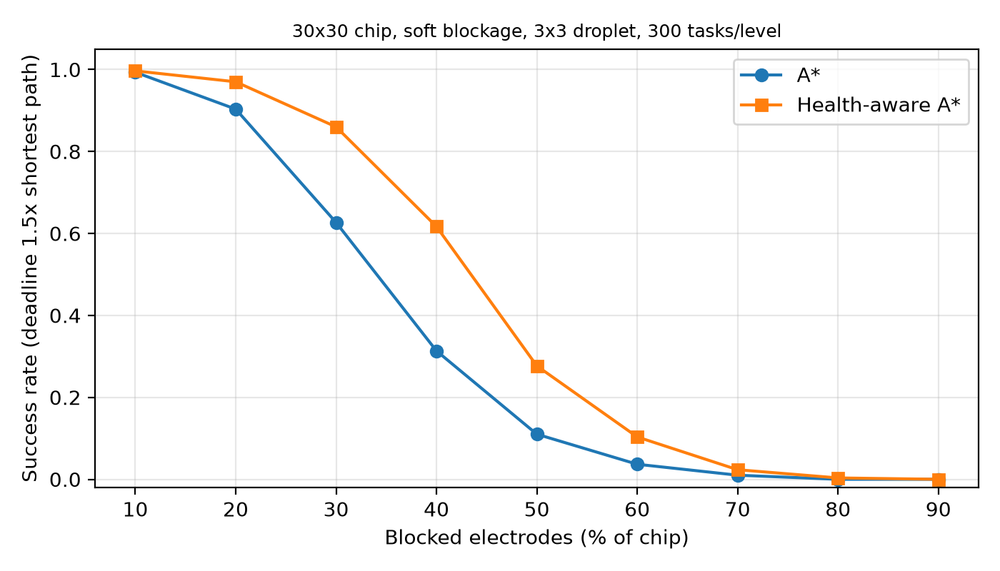
  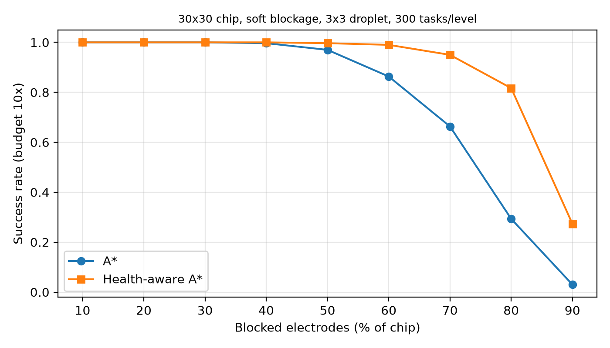
</p>

<p align="center">
  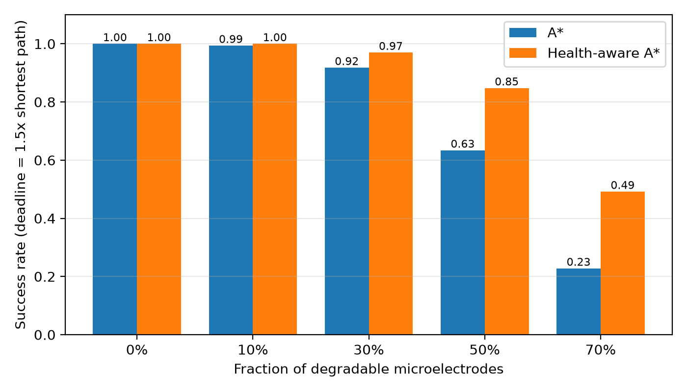
  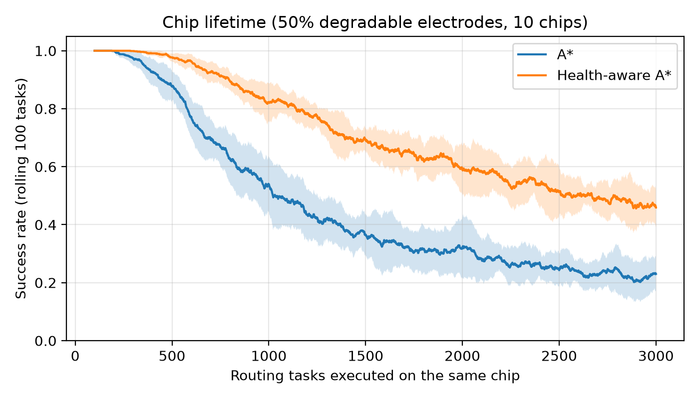
</p>

---

## Contents

1. [Supervisor feedback and new direction](#supervisor-feedback-and-new-direction)
2. [The problem](#the-problem)
3. [Our approach](#our-approach)
4. [Repository layout](#repository-layout)
5. [Getting started](#getting-started)
6. [Results in detail](#results-in-detail)
7. [Simulator details](#simulator-details)
8. [Next steps](#next-steps)
9. [Authors](#authors)
10. [References and license](#references-and-license)

---

## Supervisor feedback and new direction

After reviewing Experiments 1 to 4, Dr. Ankur Gupta raised three questions (September 2026).
This section records each question, our answer, and how it changes the project.

### 1. How is "health" defined?

*Question:* is chip health the average of every electrode's health, or the number of good
electrodes divided by all electrodes (good vs blocked)?

*Answer:* in Experiments 1 to 4, health is a **continuous value per electrode** between 0 and 1,
not a good/blocked label.

- Every electrode starts at health 1.0. A fraction of electrodes is *degradable*: each gets a decay
  factor in [0.6, 1.0], and every 50 actuations its health is multiplied by that factor
  ([`medaroute/env.py`](medaroute/env.py), `_wear`). The other electrodes never degrade.
- A move succeeds with probability = **mean health of the 3×3 electrodes under the droplet**.
- The only chip-level number reported so far (Experiment 3) is the **mean health of all electrodes**.
- The "10% / 30% / 50% / 70%" levels in Experiment 2 are the **fraction of degradable electrodes**,
  not a blockage or health percentage.

*Change:* we now also use the supervisor's definition. An electrode is either **good** (health 1)
or **blocked** (health 0), and **chip health = good electrodes ÷ all electrodes = 1 − blockage**.
With binary electrodes, the mean health and the good-electrode fraction are the same number.

### 2. Focus on blockage percentage

*Request:* show how health-aware A\* performs as the blockage goes 10%, 20%, 30%, … 90%.

*Change:* the new [Experiment 6](#experiment-6-routing-vs-blockage-percentage) does exactly this
for plain A\*, health-aware A\* and a PPO agent. **Blockage percentage is now the main axis of the project.**
Health-aware A\* beats plain A\* at every blockage level, and PPO currently performs about like plain A\*.

### 3. Why is mean chip health similar for A\* and health-aware A\* in the lifetime experiment?

*Answer:* the router is working; the metric hides it (see
[Experiment 3b](#experiment-3b-why-mean-health-hides-the-lifetime-gain)). Health-aware A\* does
*less* total work and ends with *fewer* dead electrodes, but it spreads its wear over ~40% more
electrodes. Wear is multiplicative and stops at zero: once A\* has worn out an electrode on its
fixed straight corridors, using it again cannot lower the average further. Health-aware A\* instead
wears many electrodes a little, so the chip-wide average comes out slightly lower (0.755 vs 0.79)
even though the chip lasts ~65% longer. The average is further diluted by the electrodes that never
degrade and the ones no route uses.

*Change:* lifetime is now reported with metrics that reflect usability: **number of dead electrodes**,
**mean health of the electrodes routes actually use**, and **success rate over time**.

### Where the project goes from here

1. Blockage percentage (10–90%) is the headline benchmark for every router.
2. Lifetime results use dead-electrode count and used-electrode health instead of chip-wide mean health.
3. **Next goal: make the health-aware PPO agent beat the PPO agent without health, and then health-aware A\*.**
   Right now the agent that sees the health map does no better than the one that doesn't (Experiment 4).
   See [Next steps](#next-steps).

---

## The problem

**Microfluidic biochips** (labs-on-a-chip) run lab procedures such as diluting,
mixing and detecting, on a device the size of a coin. A **MEDA** (Micro-Electrode-Dot-Array)
biochip does this by moving tiny droplets across a grid of thousands of microelectrodes:
switching on the electrodes next to a droplet pulls it one step in that direction.

The catch is that **microelectrodes degrade the more they are used** (charge trapping).
A worn electrode may fail to move the droplet, so the move has to be retried. That wastes
time, and a bioassay has deadlines. A router that always takes the shortest path keeps
driving droplets over the same electrodes and wears out whole corridors of the chip.

**Goal:** route droplets so that tasks finish on time *and* the chip stays usable for as long as possible.

## Our approach


| Router | What it optimises | Knows electrode health? |
|---|---|:---:|
| **A\*** | Fewest moves (every move costs 1) | ✗ |
| **Health-aware A\*** | Expected routing time: leaving a cell costs `1/p`, where `p` is the move-success probability, i.e. the expected number of actuation cycles | ✓ |
| **PPO (no health map)** | Learned policy; sees droplet, goal and blocked cells (Liang et al. style) | ✗ |
| **PPO (health map)** | Learned policy; also sees the electrode health map (Elfar et al. style) | ✓ |

A task **succeeds** if the droplet reaches its goal within a deadline of **1.5 × its shortest-path length**.

---

## Repository layout

```
.
├── medaroute/
│   ├── env.py                      MEDA chip simulator (Gymnasium environment)
│   └── routers.py                  A*, health-aware A* and an executor that runs a plan on the chip
├── experiments/
│   ├── exp1_visualize.py           one task: both routers' paths on a worn chip
│   ├── exp2_degradation_levels.py  success rate / routing time vs degradation level
│   ├── exp3_lifetime.py            success rate as one chip wears out over 3,000 tasks
│   ├── exp3_wear_analysis.py       how each router wears the chip (dead electrodes, used electrodes)
│   ├── exp4_ppo.py                 PPO agents with vs without the health map
│   └── exp6_blockage_sweep.py      A*, health-aware A* and PPO vs blockage 10–90%
├── results/                        figures and CSV files produced by the experiments
├── tests/                          pytest checks for the chip, its dynamics and the routers
├── run_experiments.ipynb           Google Colab notebook that runs everything
├── report/BTP_report_Final.pdf     mid-semester project report
├── CONTRIBUTORS.md
└── LICENSE
```

---

## Getting started

### Install

```bash
git clone https://github.com/nomad-gokul/AI-Based-Reliable-Droplet-Routing-for-MEDA-Biochips-Using-Deep-Reinforcement-Learning.git
cd AI-Based-Reliable-Droplet-Routing-for-MEDA-Biochips-Using-Deep-Reinforcement-Learning
pip install -r requirements.txt
```

### Check that everything works

```bash
python -m pytest        # 20 tests, under a second
```

### Reproduce the results

| Command | What it does | Time (4-core CPU) |
|---|---|---|
| `python experiments/exp1_visualize.py` | Draws both routers' paths on one worn chip | ~2 s |
| `python experiments/exp2_degradation_levels.py` | 500 chips × 5 degradation levels | ~15 s |
| `python experiments/exp3_lifetime.py` | 10 chips × 3,000 tasks each | ~1 min |
| `python experiments/exp4_ppo.py --timesteps 300000` | Trains and evaluates both PPO agents | ~12 min |
| `python experiments/exp3_wear_analysis.py` | Re-runs Experiment 3 and measures wear per router | ~3 min |
| `python experiments/exp6_blockage_sweep.py --mode soft` | A\* vs health-aware A\*, 10–90% blocked, 30×30 | ~3 min |
| `python experiments/exp6_blockage_sweep.py --mode soft --worn` | Same, with the good electrodes also partly worn | ~3 min |
| `python experiments/exp6_blockage_sweep.py --mode hard --worn` | Blocked electrodes are walls the droplet cannot cross | ~2 min |
| `python experiments/exp6_blockage_sweep.py --size 12 --ppo --ppo_steps 500000` | Adds a PPO agent (12×12 chip) | ~20 min |

Figures and CSV files are written to `results/`. Every script takes command-line options
(chip size, degradation fraction, number of chips, deadline slack, …); run it with `--help` to list them.

**No local Python?** Open [`run_experiments.ipynb`](run_experiments.ipynb) in Google Colab
and run the cells top to bottom (select a T4 GPU runtime for Experiment 4).

### Use the simulator in your own code

```python
from medaroute.env import MEDARoutingEnv
from medaroute.routers import ROUTERS, run_router

env = MEDARoutingEnv(30, 30, frac_degradable=0.5, pre_age_max=15)
obs, info = env.reset(seed=0)          # obs: 4 x 30 x 30 (droplet, goal, blocked, health)
result = run_router(env, ROUTERS["Health-aware A*"])
print(result)                          # success, steps taken, planned path length
```

---

## Results in detail

All numbers below come from running the scripts in this repository with their default
settings. The raw numbers are in the CSV files in [`results/`](results/).

### Experiment 1: the two baselines on one task

<p align="center">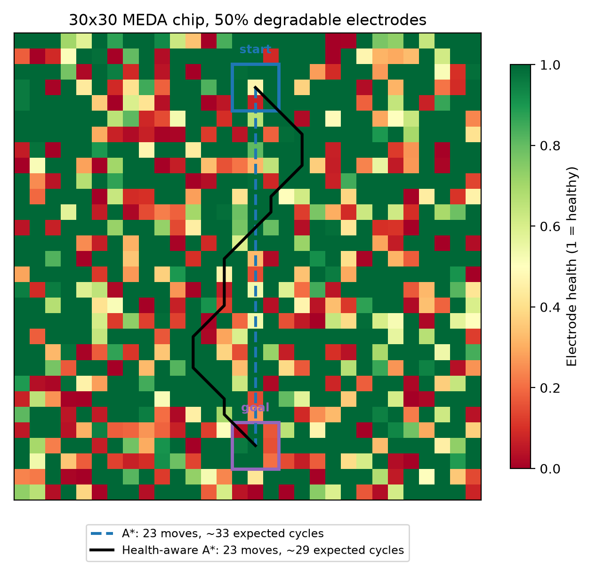</p>

A 30×30 chip where half the electrodes can degrade (red = worn, green = healthy).
Both routers need **23 moves**, but A\* (dashed) goes straight through weak electrodes
while health-aware A\* (solid) curves around them. Expected routing time drops from
**~33 to ~29 cycles (about 12% faster)** without a longer path.

### Experiment 2: success rate vs degradation level

500 pre-aged 30×30 chips per level, one random task each; both routers solve identical copies of each chip.

| Degradable electrodes | A\* success | Health-aware A\* success | Gain | A\* time (cycles) | Health-aware A\* time (cycles) |
|:---:|:---:|:---:|:---:|:---:|:---:|
| 0%  | 1.000 | 1.000 | – | 14.6 | 14.6 |
| 10% | 0.994 | **1.000** | +0.6 pts | 15.4 | **14.8** |
| 30% | 0.918 | **0.970** | +5.2 pts | 17.5 | **16.3** |
| 50% | 0.634 | **0.848** | +21.4 pts | 19.2 | **18.6** |
| 70% | 0.228 | **0.492** | **+26.4 pts** | 18.2 | 19.8 |

<p align="center">
  
  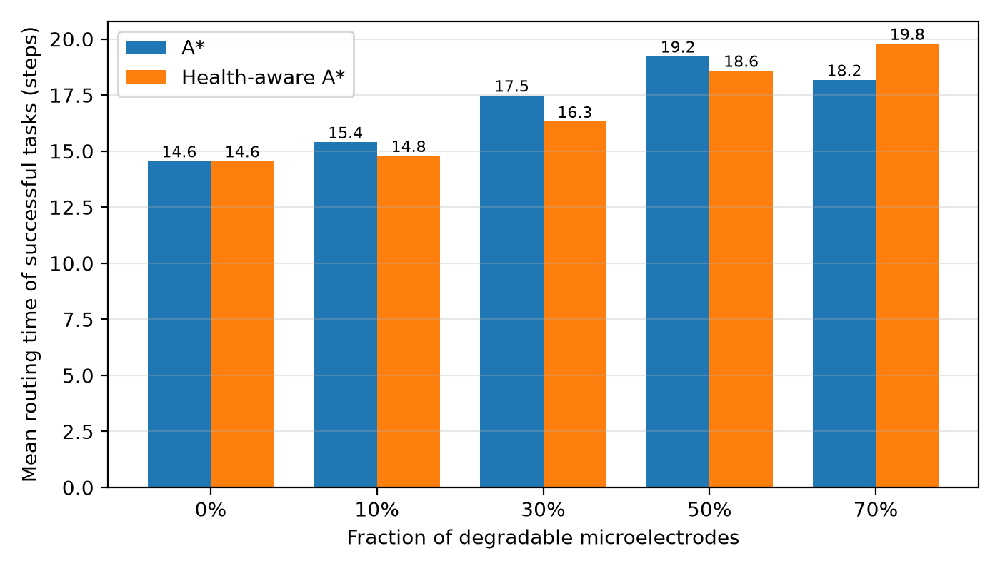
</p>

- Both routers plan paths of almost the same length (14.2–14.6 moves), so the difference comes entirely from *where* the path goes.
- Plain A\* collapses as the chip degrades, from 91.8% success at 30% to 22.8% at 70%.
- At 70%, health-aware A\* looks slightly slower only because it also finishes the harder tasks that A\* fails.

### Experiment 3: chip lifetime

10 fresh 30×30 chips (50% degradable), each running 3,000 tasks between six fixed
reservoir/mixer sites, as a real bioassay would. Both routers get the same chips and task sequences.

| Router | Tasks before first failure | Overall success |
|---|:---:|:---:|
| A\* | 241 ± 43 | 0.47 ± 0.05 |
| **Health-aware A\*** | **397 ± 110** | **0.72 ± 0.04** |

<p align="center"></p>
<p align="center">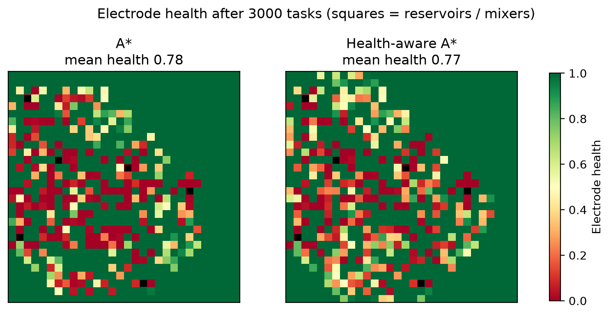</p>

- A\* keeps using the same straight corridors between sites until they die; health-aware A\* spreads the wear over a larger area.
- Health-aware A\* still declines steadily: it reacts to current health but cannot plan for the wear its own routes will cause. **This is the main motivation for a learned (DRL) router.**
- "Tasks before first failure" varies a lot between chips (one unlucky failure ends the count), so overall success is the more stable metric.

### Experiment 3b: why mean health hides the lifetime gain

`exp3_wear_analysis.py` re-runs Experiment 3 with the same chips and task sequences and records
how each router wears the chip. Means over the 10 chips:

| | A\* | Health-aware A\* |
|---|:---:|:---:|
| Overall success | 0.47 | **0.72** |
| Tasks before first failure | 241 | **397** |
| Total actuations (droplet steps) | 60,475 | **57,019** |
| Electrodes used at least once | 472 | 659 |
| Mean health, all 900 electrodes | **0.79** | 0.755 |
| Dead electrodes (health < 0.1) | 144 | **127** |
| Mean health of the electrodes used | 0.60 | **0.67** |

<p align="center">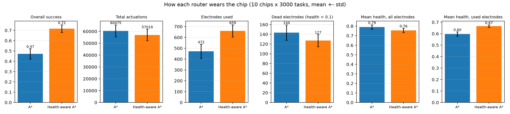</p>

- Health-aware A\* has fewer dead electrodes on **all 10 chips**, and needs fewer actuations in total.
- It uses ~40% more electrodes, wearing each one a little instead of wearing out a few corridors completely.
  Because health is multiplicative and floors at zero, that lowers the chip-wide *average* even though
  the chip stays usable much longer.
- So chip-wide mean health is a poor lifetime metric. We now report dead electrodes, health of the used
  electrodes, and success over time.

### Experiment 4: first PPO agents

Two PPO agents (Stable-Baselines3, small 3-layer CNN) trained for 300k steps each on
12×12 chips with 50% degradable electrodes, a new random pre-aged chip every episode.
One agent sees the electrode health map; the other doesn't. All four methods are then tested
on the **same 500 unseen chips**.

| Method | Test success rate | Routing time of successful tasks (cycles) |
|---|:---:|:---:|
| A\* | 0.644 | 9.0 |
| **Health-aware A\*** | **0.788** | **8.8** |
| PPO without health map | 0.684 | 9.1 |
| PPO with health map | 0.662 | 9.1 |

<p align="center">
  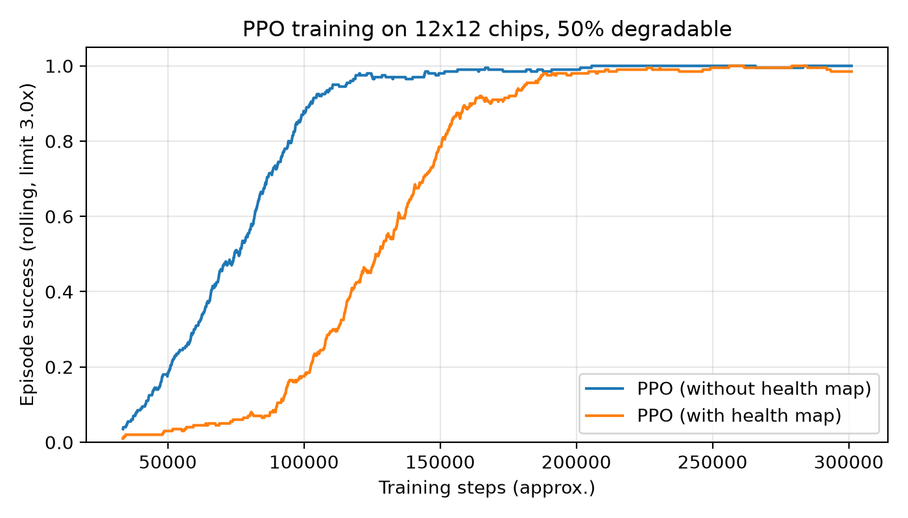
  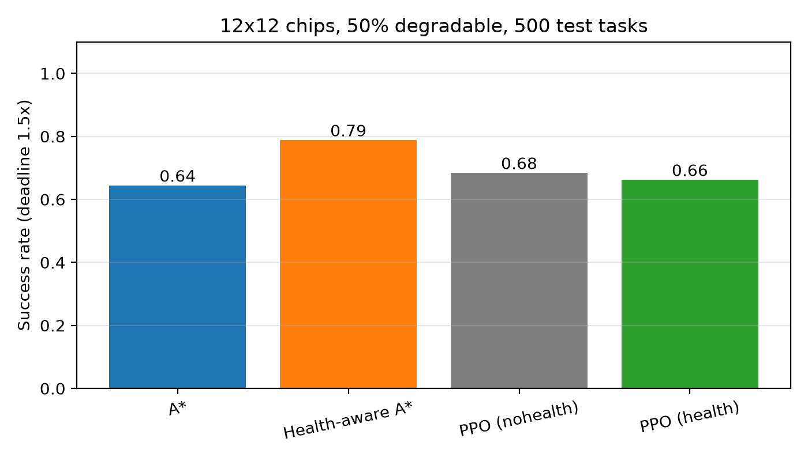
</p>

- **Both agents learn to route:** training success climbs from ~0 to ~99–100% (left), and on unseen chips both beat plain A\*.
- **Neither beats health-aware A\* yet, and the health map hasn't helped so far.** The agent with the health channel
  learns more slowly (90% training success after ~160k steps vs ~100k), so it has less time left to refine its policy.
- The training step limit (3× shortest path) is looser than the test deadline (1.5×), and health affects the reward only
  indirectly through failed moves. These are the first things to change (see [Next steps](#next-steps)).
- With 500 test tasks the standard error is about ±2 percentage points and only one seed was trained, so the gaps
  between the PPO agents and A\* are not yet conclusive.

> Numbers are from a CPU run of `exp4_ppo.py --timesteps 300000`. RL training is not bit-for-bit reproducible across
> hardware, so a GPU run gives slightly different values (the report's Colab run got 0.690 and 0.650).

### Experiment 6: routing vs blockage percentage

Each electrode is independently **blocked** (health 0) with probability *b*, otherwise **good** (health 1),
so chip health = 1 − *b*. *b* is swept from 10% to 90%, with 300 random chips (one task each) per level;
every method gets the same chip and task. Success is measured two ways: within the bioassay deadline
(1.5× the shortest path), and with no real deadline (10× budget).

**Main setting** (30×30 chip, 3×3 droplet; the droplet may sit on blocked electrodes and a move succeeds
with probability = share of good electrodes under it, the same physics as the rest of the simulator):

| Blocked | A\* (deadline) | Health-aware A\* (deadline) | A\* (no deadline) | Health-aware A\* (no deadline) |
|:---:|:---:|:---:|:---:|:---:|
| 10% | 0.99 | **1.00** | 1.00 | 1.00 |
| 20% | 0.90 | **0.97** | 1.00 | 1.00 |
| 30% | 0.63 | **0.86** | 1.00 | 1.00 |
| 40% | 0.31 | **0.62** | 1.00 | 1.00 |
| 50% | 0.11 | **0.28** | 0.97 | **1.00** |
| 60% | 0.04 | **0.10** | 0.86 | **0.99** |
| 70% | 0.01 | **0.02** | 0.66 | **0.95** |
| 80% | 0.00 | 0.00 | 0.29 | **0.82** |
| 90% | 0.00 | 0.00 | 0.03 | **0.27** |

<p align="center">
  
  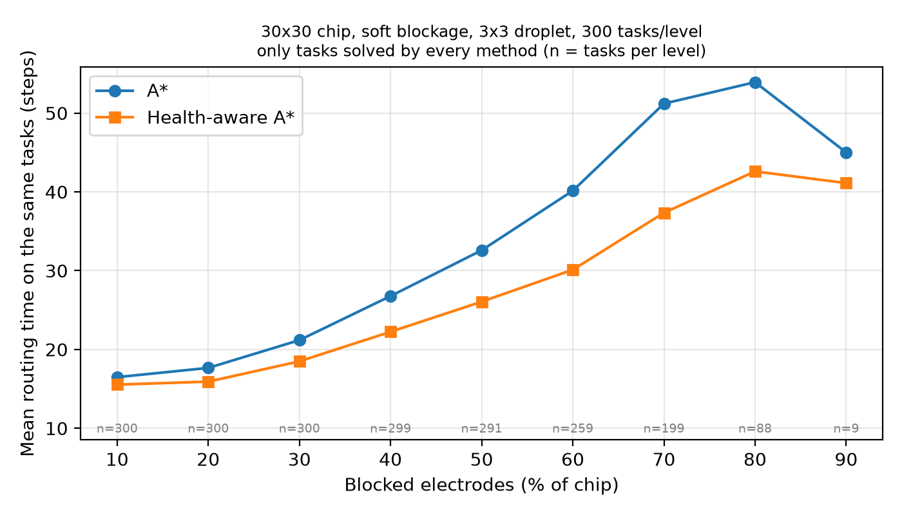
</p>

**With PPO** (12×12 chip; one PPO agent trained for 500k steps on chips with random 0–90% blockage,
observing the blockage map). Deadline success:

| Blocked | 10% | 20% | 30% | 40% | 50% | 60% | 70% | 80% | 90% |
|---|:---:|:---:|:---:|:---:|:---:|:---:|:---:|:---:|:---:|
| A\* | 0.96 | 0.91 | 0.66 | 0.52 | 0.31 | 0.15 | 0.06 | 0.03 | 0.02 |
| **Health-aware A\*** | **0.98** | **0.94** | **0.76** | **0.65** | **0.40** | **0.21** | **0.11** | **0.05** | **0.02** |
| PPO | 0.94 | 0.89 | 0.65 | 0.49 | 0.28 | 0.11 | 0.06 | 0.03 | 0.00 |

<p align="center">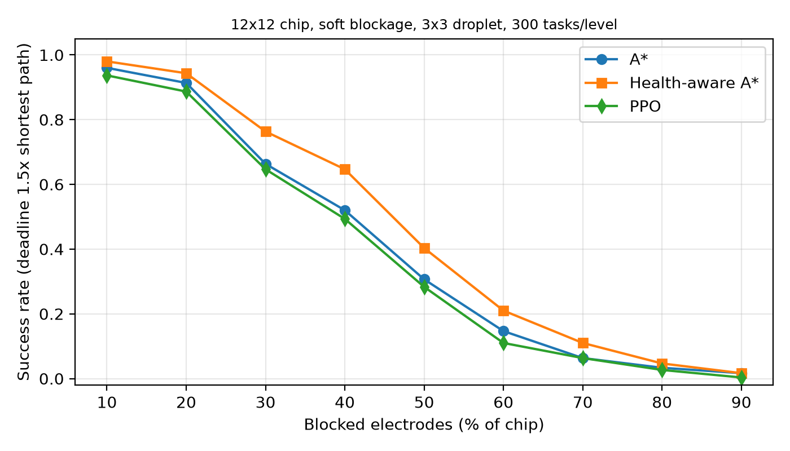</p>

- **Health-aware A\* wins at every blockage level.** Its advantage is largest between 20% and 50% blocked
  when a deadline applies, and between 60% and 90% when it does not.
- **Health-aware A\* is also faster at every blockage level.** Routing time is compared on the same tasks:
  only tasks that every method solved count (the `n` under each point). Averaging each method over its own
  successes would be misleading, because health-aware A\* also completes long, hard tasks that A\* fails.
  On the same tasks it needs 6% fewer steps at 10% blocked, 17% at 40%, 27% at 70% and 21% at 80%, and it is
  the faster router on 45–78% of tasks, against 0–6% for A\* (the rest are ties).
- **PPO performs about like plain A\*** and stays below health-aware A\*, the same picture as Experiment 4.
- Two further chip models are in [`results/blockage_sweep/`](results/blockage_sweep/):
  `*_soft_30_worn` (blocked electrodes plus partly worn good ones: same ranking, larger gaps) and
  `*_hard_30_worn` (blocked electrodes are walls a 1×1 droplet cannot cross: health-aware A\* meets the
  deadline on 84% of tasks at 10% blocked vs 10% for A\*; above ~60% blocked most goals are cut off
  entirely, see the `reachable_tasks` column, so no router can succeed).
- With walls and no partial wear, A\* and health-aware A\* would plan identical routes: health-awareness
  pays off only when electrode health is graded, not purely good/blocked.

---

## Simulator details

The chip model follows Liang et al. (ICML 2021, [`tcliang-tw/meda-env`](https://github.com/tcliang-tw/meda-env)).
Their code needs TensorFlow 1 and the old `stable_baselines`, so it was reimplemented on Gymnasium.

| Aspect | Model |
|---|---|
| Droplet | Square block of microelectrodes (3×3 by default) that moves in 8 directions |
| Move success | Probability = mean health of the electrodes under the droplet; a failed move leaves it in place and is retried |
| Wear | A fraction of electrodes is degradable, each with a decay factor in [0.6, 1.0]; every 50 actuations its health is multiplied by that factor |
| Observation | 4 × H × W: droplet, goal, blocked cells, electrode health map (`observe_health=False` drops the health channel for the ablation) |
| Reward | +1 at the goal, −0.05 for a step that gets closer, −0.1 otherwise |

Differences from meda-env: one-microelectrode steps (finer MEDA control), exact goal overlap,
health updated after every step, optional pre-aged chips (`pre_age_max`) and fixed
reservoir/mixer sites (`task_mode="ports"`).

---

## Next steps

**Main goal: make the health-aware PPO agent clearly better than the PPO agent without health,
and then better than health-aware A\*.** Today the agent that sees the health map does no better
(66% vs 68% in Experiment 4), so the extra information is not being used yet. Planned changes:

- [ ] Add a health term to the reward (`degrade_penalty` is already supported by the simulator), so
      routing over worn or blocked electrodes costs the agent directly instead of only through failed moves
- [ ] Train with the same 1.5× deadline used at test time (training currently allows 3×)
- [ ] Train for 1–2 M steps over 3–5 seeds, and compare health vs no-health at each blockage level (Experiment 6)
- [ ] Give the agent health-aware A\*'s cost map as an extra input, or warm-start it by imitating health-aware A\*
- [ ] Curriculum over blockage percentage (start easy, increase blockage as the agent improves)

Other work following the supervisor's feedback:

- [x] Define chip health as good electrodes ÷ all electrodes and sweep blockage 10–90% (Experiment 6)
- [x] Explain the Experiment 3 mean-health result and add better lifetime metrics (Experiment 3b)
- [ ] Track how the blocked percentage grows over time in the lifetime experiment, for each router
- [ ] Add a wear-levelling term to health-aware A\* (penalise electrodes by how often they are used)
- [ ] Evaluate the learned router on the chip-lifetime benchmark (Experiment 3)

---

## Authors

| Name | Roll number |
|---|---|
| Kashika Puri | 2023UCA1885 |
| Gokul Kumar | 2023UCA1919 |
| Mohammed Eshaan | 2023UCA1960 |

Supervised by **Dr. Ankur Gupta**, Department of Computer Science and Engineering, NSUT.
The full mid-semester report is in [`report/BTP_report_Final.pdf`](report/BTP_report_Final.pdf).
See also [`CONTRIBUTORS.md`](CONTRIBUTORS.md).

## References and license

- T.-C. Liang, J. Zhou, Y.-S. Chan, T.-Y. Ho, K. Chakrabarty and C.-Y. Lee, "Parallel droplet control in MEDA biochips using multi-agent reinforcement learning," *Proc. 38th ICML*, PMLR vol. 139, pp. 6588–6599, 2021.
- M. Elfar, Y.-C. Chang, H. H.-Y. Ku, T.-C. Liang, K. Chakrabarty and M. Pajic, "Deep reinforcement learning-based approach for efficient and reliable droplet routing on MEDA biochips," *IEEE Trans. CAD*, vol. 42, no. 4, pp. 1212–1222, 2023.
- The full reference list is in the [report](report/BTP_report_Final.pdf).

Released under the [MIT License](LICENSE).
